<style> bg:url(assets/img/background_white_astronaut.png);background-size:cover;</style>


<q>The capacity of light to carry and convey information is perhaps its most important, and remarkable, characteristic.  </q>

<div style="position: absolute; left: 50px; top:400px;">
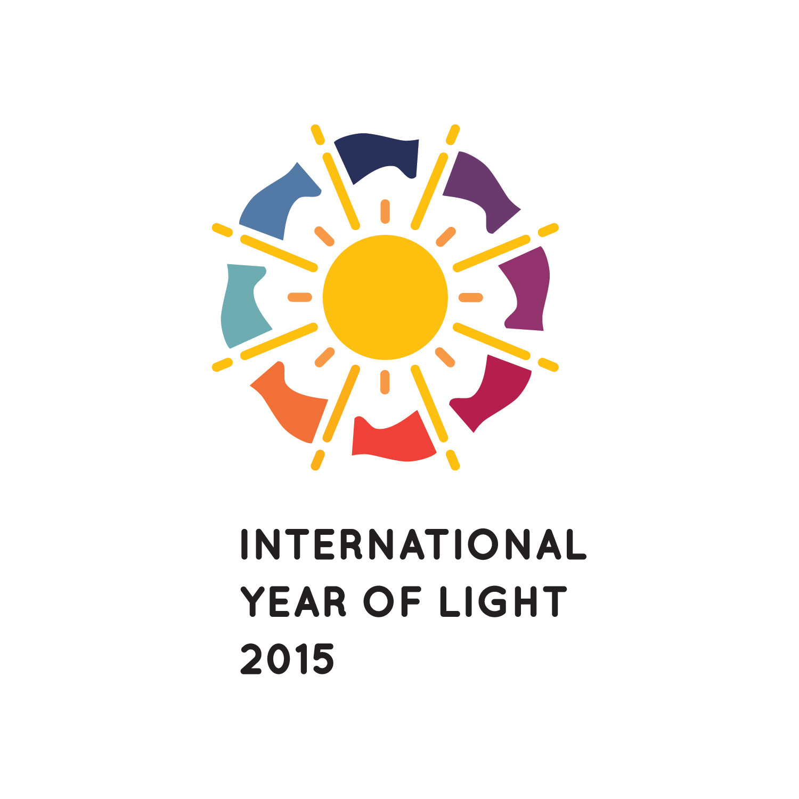</div>
<div style="position: absolute; left: 200px; top:500px;">
<pw>Ian Walmsley in 'Light : A very short introduction', Oxford University Press.</pw>
</div>


--- .class1 #id1 bg:black;

<!--
ONLY HTTPS SITES NOW WORK ON GH-PAGES
<iframe src="http://stuffin.space/" width="854" height="480" frameborder="-1" allowfullscreen></iframe>
-->
<div>
<pw><a href="http://stuffin.space/"></a><br>"<a href="http://stuffin.space/">Stuff in Space</a>" by James Yoder.</pw>
</div> 


--- .class1 #id1 bg:black;

<iframe width="560" height="315" src="https://www.youtube-nocookie.com/embed/xcflQZJ5n88?controls=0&amp;showinfo=0;&start=0" frameborder="-1" allowfullscreen></iframe>

<div style="position: absolute; left: 150px; top:650px; z-index:10; font-size:14px">
    <p>https://youtu.be/xcflQZJ5n88</p>
</div>

--- .segue #id2 bg:url(assets/img/background_space.png);background-size:cover;
## Remote sensing 101

--- &twocol .class1 #id3 bg:url(assets/img/background_white_astronaut.png);background-size:cover;
## Platform, sensor and resolution

*** =left
### Satellite
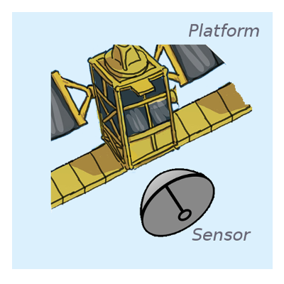

*** =right
### Platform
[Landsat 8](http://landsat.usgs.gov/landsat8.php), [Sentinel 1A](https://sentinel.esa.int/web/sentinel/missions/sentinel-1), [Sentinel 2A](https://sentinel.esa.int/web/sentinel/missions/sentinel-2)

### Sensor or Instrument
[OLI](http://landsat.usgs.gov/ldcm_vs_previous.php) + [TIRS](http://landsat.usgs.gov/ldcm_vs_previous.php), [C-SAR](https://sentinel.esa.int/web/sentinel/sentinel-1-sar-wiki/-/wiki/Sentinel%20One/Instrument), [MSI](https://sentinel.esa.int/web/sentinel/technical-guides/sentinel-2-msi/msi-instrument)

### Resolution
+ Spatial: Pixel size, extent
+ Temporal: Revisit time
+ Spectral: Band width, Number of bands, Sensitivity

--- &twocol .class1 #id3 bg:url(assets/img/background_white_astronaut.png);background-size:cover;
## Electromagnetic radiation

*** =left
Has both wave and particle properties at the same time (wave-particle duality).

+ Waves can be described by their <b>amplitude</b> and <b>wavelength</b>
+ <b>Polarisation:</b> waves oscillate in more than one orientation
+ <b>Photons</b> are the elementary particles of eletromagnetic radiation
+ Photons can be interact with matter by <b>scattering</b> and <b>absorption</b>
+ <b>Reflectance</b> is scattering in a defined direction
    
*** =right

<div>
<pw><a href="https://commons.wikimedia.org/wiki/File:Electromagneticwave3D.gif#/media/File:Electromagneticwave3D.gif"></a><br>"<a href="https://commons.wikimedia.org/wiki/File:Electromagneticwave3D.gif#/media/File:Electromagneticwave3D.gif">Electromagneticwave3D</a>" by <a href="//commons.wikimedia.org/wiki/User:Lookang" title="User:Lookang">Lookang</a> many thanks to <a rel="nofollow" class="external text" href="http://www.phy.ntnu.edu.tw/ntnujava/index.php">Fu-Kwun Hwang</a> and <a rel="nofollow" class="external text" href="http://www.compadre.org/osp/items/detail.cfm?ID=7305">author of Easy Java Simulation = Francisco Esquembre</a> - <span class="int-own-work" lang="en">Own work</span>. Licensed under <a title="Creative Commons Attribution-Share Alike 3.0" href="http://creativecommons.org/licenses/by-sa/3.0">CC BY-SA 3.0</a> via <a href="https://commons.wikimedia.org/wiki/">Commons</a>.</pw>
</div> 

--- .class1 #id3 bg:url(assets/img/background_white_astronaut.png);background-size:cover;
## Electromagnetic wave spectrum
<pw><a href="https://commons.wikimedia.org/wiki/File:EM_spectrum.svg#/media/File:EM_spectrum.svg"></a><br>"<a href="https://commons.wikimedia.org/wiki/File:EM_spectrum.svg#/media/File:EM_spectrum.svg">EM spectrum</a>". Licensed under <a href="http://creativecommons.org/licenses/by-sa/3.0/" title="Creative Commons Attribution-Share Alike 3.0">CC BY-SA 3.0</a> via <a href="https://commons.wikimedia.org/wiki/">Commons</a>.</pw>

--- .class1 #id3 bg:url(assets/img/background_white_astronaut.png);background-size:cover;
## Atmospheric electromagnetic opacity

<pw><a href="https://commons.wikimedia.org/wiki/File:Atmospheric_electromagnetic_opacity.svg#/media/File:Atmospheric_electromagnetic_opacity.svg"></a><br>"<a href="https://commons.wikimedia.org/wiki/File:Atmospheric_electromagnetic_opacity.svg#/media/File:Atmospheric_electromagnetic_opacity.svg">Atmospheric electromagnetic opacity</a>" by NASA (original); SVG by <a href="//en.wikipedia.org/wiki/User:Mysid" class="extiw" title="w:User:Mysid">Mysid</a>. - Vectorized by <a href="//en.wikipedia.org/wiki/User:Mysid" class="extiw" title="w:User:Mysid">User:Mysid</a> in Inkscape, original NASA image from <a href="//commons.wikimedia.org/wiki/File:Atmospheric_electromagnetic_transmittance_or_opacity.jpg" title="File:Atmospheric electromagnetic transmittance or opacity.jpg">File:Atmospheric electromagnetic transmittance or opacity.jpg</a>.. Licensed under Public Domain via <a href="https://commons.wikimedia.org/wiki/">Commons</a>.</pw>

--- &twocol .class1 #id3 bg:url(assets/img/background_white_astronaut.png);background-size:cover;
## Passive visible and infrared

*** =left

<pw>
<a href="/" title="Ocean Optics Web Book"><strong>Ocean Optics Web Book</strong></a> • All contents <a href="http://creativecommons.org/licenses/by/2.0/" title="Creative Commons Attribution license" target="_new"></a> 2015 <a href="http://creativecommons.org/licenses/by/2.0/" title="Creative Commons Attribution license" target="_new">Creative Commons Attribution</a> license.
</pw>

*** =right
### Measures (sun) light

  + day-time only*
  + <b>radiance</b> (light) passes through atmosphere
      + affected by scattering and absorption
      + affected by *clouds*
      + requires *atmospheric correction procedures*

--- &twocol .class1 #id3 bg:url(assets/img/background_white_astronaut.png);background-size:cover;
## Passive visible and infrared

*** =left
The surfaces of substances have specific <b>scattering</b> and <b>absorption</b> properties

  + allows identification of surfaces (i.e, the blue surface)
  + allows quantification of substances (i.e., the number of blue 'rocks')
  
*** =right
<p style= "width: 350px; text-align: right";>
<span style="color:red; font-weight:bold">Red</span> and <span style="color:green; font-weight:bold">green</span> light is absorbed, <span style="color:blue; font-weight:bold">blue</span> reflected.
</p>

<pw><a href="https://commons.wikimedia.org/wiki/File:Simple_reflectance.svg#/media/File:Simple_reflectance.svg"> </a><br>"<a href="https://commons.wikimedia.org/wiki/File:Simple_reflectance.svg#/media/File:Simple_reflectance.svg">Simple reflectance</a>" by <a href="//commons.wikimedia.org/wiki/User:Phidauex" title="User:Phidauex">User:Phidauex</a> - <span class="int-own-work" lang="en">Own work</span>. Licensed under Public Domain via <a href="https://commons.wikimedia.org/wiki/">Commons</a>.</pw>

--- .class1 .vcenter #id3 bg:url(assets/img/background_white_astronaut.png);background-size:cover;
## Passive visible and infrared
<p style= "width: 900px;">
Water strongly absorbs light giving it a distinctive <b>reflectance spectrum</b> that can be summarised by spectral indices (ratios), e.g., the 'Normalised Difference Water Index' (NDWI, <a href=http://www.tandfonline.com/doi/abs/10.1080/01431169608948714>McFeeters et al. 1996</a>).
</p>

<div style="position: absolute; left: 210px; top:225px;">
<pw><a href="https://commons.wikimedia.org/wiki/File:Absorption_spectrum_of_liquid_water.png#/media/File:Absorption_spectrum_of_liquid_water.png"></a><br>"<a href="https://commons.wikimedia.org/wiki/File:Absorption_spectrum_of_liquid_water.png#/media/File:Absorption_spectrum_of_liquid_water.png">Absorption spectrum of liquid water</a>" by <a href="//en.wikipedia.org/wiki/User:Kebes" class="extiw" title="wikipedia:User:Kebes">Kebes</a> at <a href="//en.wikipedia.org/wiki/" class="extiw" title="wikipedia:">English Wikipedia</a>. Licensed under <a title="Creative Commons Attribution-Share Alike 3.0" href="http://creativecommons.org/licenses/by-sa/3.0">CC BY-SA 3.0</a> via <a href="https://commons.wikimedia.org/wiki/">Commons</a>.</pw>
</div>

<div style="position: absolute; left: 400px; top:190px; z-index:10; font-size:18px">
    <p><b>NDWI</b> = (<span style="color:#a23c52;font-weight:bold">NIR</span> - <span style="color:green; font-weight:bold">Green</span>)/(<span style="color:#a23c52;font-weight:bold">NIR</span> + <span style="color:green; font-weight:bold">Green</span>)</p>
</div>


--- .class1 .vcenter #id3 bg:url(assets/img/background_white_astronaut.png);background-size:cover;
## Passive visible and infrared
<p style= "width: 900px;">
All photosynthetic organisms contain chlorophyll giving them a distinctive <b>reflectance spectrum</b> that can be summarised by spectral indices (ratios), e.g., the 'Normalised Difference Vegetation Index' (NDVI).
</p>

<div style="position: absolute; left: 210px; top:230px;">
<pw><a href="http://wiki.landscapetoolbox.org/lib/exe/detail.php/remote_sensing_methods:veg_spectral_response.jpg?id=remote_sensing_methods%3Anormalized_difference_vegetation_index">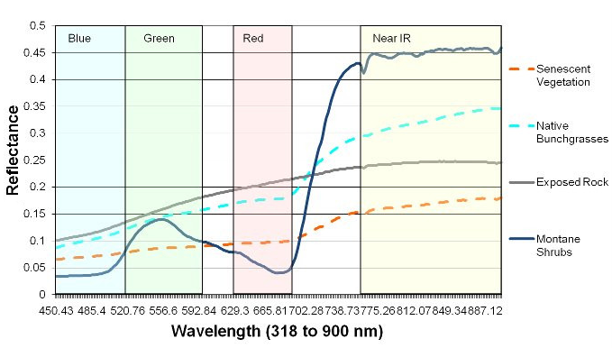 </a>
<br>"<a href="http://wiki.landscapetoolbox.org/lib/exe/detail.php/remote_sensing_methods:veg_spectral_response.jpg?id=remote_sensing_methods%3Anormalized_difference_vegetation_index">Vegetation spectral response</a>" by <a href="http://wiki.landscapetoolbox.org"> wiki.landscapetoolbox.org</a>. Licensed under Public Domain via <a href="https://commons.wikimedia.org/wiki/">Commons</a>.</pw>
</div>

<div style="position: absolute; left: 400px; top:225px; z-index:10; font-size:18px">
    <p><b>NDVI</b> = (<span style="color:#a23c52;font-weight:bold">NIR</span> - <span style="color:red; font-weight:bold">Red</span>)/(<span style="color:#a23c52;font-weight:bold">NIR</span> + <span style="color:red; font-weight:bold">Red</span>)</p>
</div>

--- .class1 #id3 bg:url(assets/img/background_white_astronaut.png);background-size:cover;
## Passive visible and infrared
<p style= "width: 900px;">
The different pigments of photosynthetic organisms result in different 'colours', potentially allowing <b>identification of foreshore vegetation types</b>.
</p>
<div style="position: absolute; left: 50px; top:200px;">
<pw><a href="https://en.wikipedia.org/wiki/Chloroplast#Structure"> </a>
<br><a href="https://en.wikipedia.org/wiki/Chloroplast#Structure">wikipedia.org/wiki/Chloroplast</a>.</pw>
</div>

--- .class1 #id3 bg:url(assets/img/background_white_astronaut.png);background-size:cover;
## Passive visible and infrared

[Colorvision Cadiz Bay](http://www.esa.int/Our_Activities/Observing_the_Earth/Copernicus/Sentinel-2/Highlights/And_the_winner_is)

<a data-flickr-embed="true"  href="https://www.flickr.com/photos/125003624@N04/17892737690/in/album-72157645194099219/" title="Saltmarshes of Cádiz Bay"></a><script async src="//embedr.flickr.com/assets/client-code.js" charset="utf-8"></script>


--- &twocol .class1 #id3 bg:url(assets/img/background_white_astronaut.png);background-size:cover;
## Passive visible and infrared
<p style= "width: 900px;">
Spectral ratios, such as NDWI and NDVI can be used to <b>quantify properties of foreshores</b>.
</p>

*** =left
<div>
<pw><a href="http://www.springerlink.com/content/y221800764571628">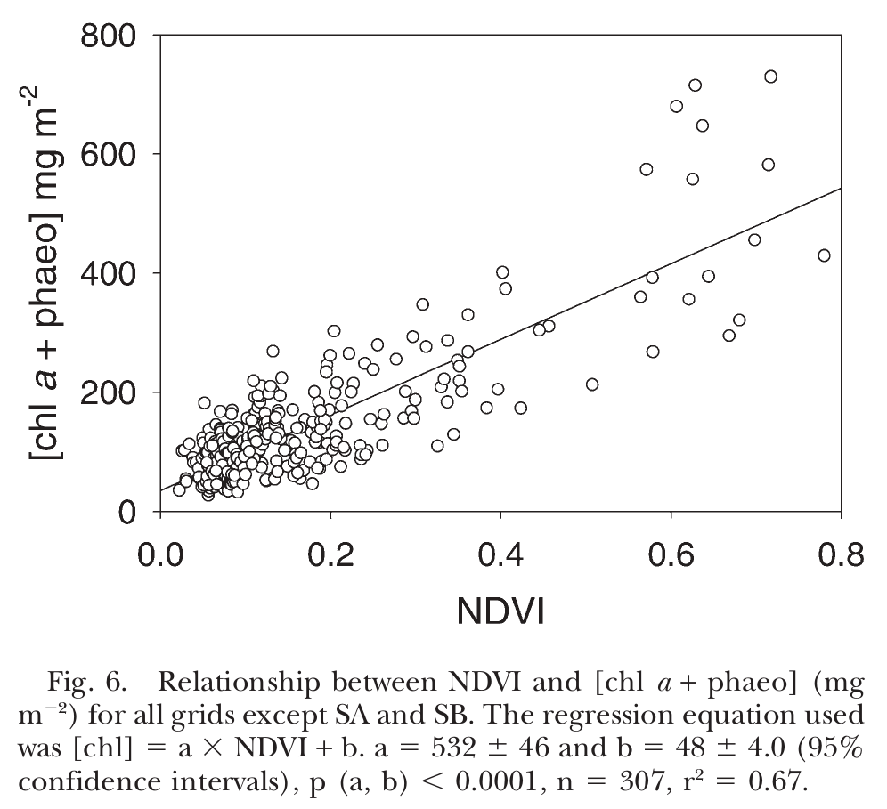 </a>
<br>"<a href="http://www.springerlink.com/content/y221800764571628">Fig. 6 Relationship between NDVI and chlorophyll...</a>" by <a href="http://www.springerlink.com/content/y221800764571628"> Kromkamp et al. 2006</a>. </pw>
</div>

*** =right
<div>
<pw>
<br>"Time-ensemble (2000-2015) mean modified normalised difference water index (MNDWI) of Cadiz Bay derived from the Landsat (USGS) archive" by <a href="http://www.fast-space-project.eu"> FAST project</a>. </pw>
</div>


--- &twocol .class1 #id3 bg:url(assets/img/background_white_astronaut.png);background-size:cover;
## Active radio

*** =right
<div>
<pw>
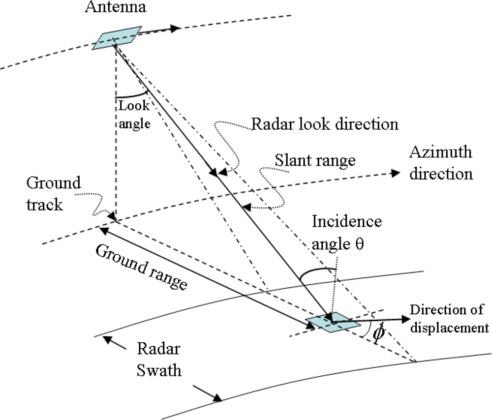 "A geometric model of a SAR system" by <a href="http://www.mdpi.com/1424-8220/9/3/1876"> Zhou et al. 2009</a>.
</pw>
</div>

*** =left
### Synthetic Aperture Radar (SAR)

+ active radio pulses sent and collected
+ effective antena size much larger using movement of satellite and clever processing (Synthetic Aperture).
+ measures polarised radio waves e.g., horizontal and vertical.
+ allows increased spatial resolution.

---  .class1 #id3 bg:url(assets/img/background_white_astronaut.png);background-size:cover;
## Active Radio

### Synthetic Aperture Radar (SAR)

+ most common bands are L, C and X
+ different band frequencies are suited to different applications
    + penetrating canopies: L and P, very high resolution: X, multi-purpose: C

<div>
 <pw>"Commonly used frequency bands..." by <a href="http://elib.dlr.de/82313/1/SAR-Tutorial-March-2013.pdf">Moreira et al. 2013</a>.
</pw>
</div>


--- &twocol .class1 #id3 bg:url(assets/img/background_white_astronaut.png);background-size:cover;
## Active Radio

*** =right
### Surface interactions 

+ still water tends to be a specular reflector of radio waves i.e, usually low backscatter.
+ complex interactions with vegetation result in different return signals.
+ buildings often have strong backscatter signal.
+ interactions vary with beam polarization i.e., different polarizations provide more information.

*** =left

<div .center>
<pw>
 "Surface and volume scattering of a SAR beam for trees " by (<a href="http://www.intechopen.com/books/advances-in-geoscience-and-remote-sensing/forest-inventory-using-optical-and-radar-remote-sensing">Fernandez-Ordonez et al. 2009.</a>).
</pw>
</div>

--- &twocol .class1 #id3 bg:url(assets/img/background_white_astronaut.png);background-size:cover;
## Active Radio

*** =right
### Speckle

+ caused by the many scatterers in a 'pixel'.
+ coherence of the scattered signal results in strong fluctuations across the image.
+ 'multi-looking' used to reduce speckle at cost of spatial resolution.
    + non-coherent averaging of the intensity image.
+ adaptive filtering can also be used to reduce speckle.

*** =left

<div>
<pw>
 "Speckle occurs in SAR images due to the coherent 
sum of many elemental scatterers within a resolution cell..." by <a href="http://elib.dlr.de/82313/1/SAR-Tutorial-March-2013.pdf">Moreira et al. 2013</a>.
</pw>
</div>

--- .class1 #id3 bg:black;
## Active Radio

<div style="position:absolute; left=0;">
<pw>
 <a href="http://sedas.satapps.org/wp-content/uploads/revslider/slider1/banner-bangladesh1.jpg"> "Interferometric Wide Swath Dual-Polarisation Sentinel-1 acquired on 2nd December 2014, band combination: VH-VV-VH (RGB) over the Sundarbans Mangrove, India and Bangladesh." © Copernicus (2014 / 2015) / ESA Image © Satellite Application Catapult Ltd, 2014</a>.
</pw>
</div>


--- .class1 #id3 bg:url(assets/img/background_white_astronaut.png);background-size:cover;
## Further resources

General:

+ [Glossary of remote sensing terms](https://directory.eoportal.org/documents/163813/238965/Glossary.pdf)
+ [EO portal database of satellite missions](https://directory.eoportal.org/web/eoportal/satellite-missions)
+ [Landscape Toolbox Wiki](http://wiki.landscapetoolbox.org)

Passive visible and infrared:

+ [Ocean optics web book](http://www.oceanopticsbook.info/)

Active radar (SAR):

+ [Moreira, A., Prats-Iraola, P., Younis, M., Krieger, G., Hajnsek, I., & Papathanassiou, K. P. (2013). A tutorial on synthetic aperture radar. Geoscience and Remote Sensing Magazine, IEEE, 1(1), 6-43.](http://elib.dlr.de/82313/1/SAR-Tutorial-March-2013.pdf)
+ [SAREDU](https://saredu.dlr.de/); full open-access course on SAR by [DLR](http://www.dlr.de)


--- .segue #id4 bg:url(assets/img/background_copernicus_logo.png);background-size:cover;
## Copernicus Services

--- .class1 #id5
## Copernicus Services
<!--
ONLY HTTPS SITES NOW WORK ON GH-PAGES
<!<iframe width="560" height="315" src="https://www.copernicus.eu/main/services" frameborder="-1" allowfullscreen></iframe>
-->
<div>
<pw><a href="http://www.copernicus.eu/main/services"></a><a href="http://www.copernicus.eu/main/services">http://www.copernicus.eu/main/services</a></pw>
</div> 

--- .class1 #id5
## Copernicus - Sentinel Online
<!--
<iframe width="560" height="315" src="https://sentinels.copernicus.eu/web/sentinel/home" frameborder="-1" allowfullscreen></iframe>
-->
<div>
<pw><a href="https://sentinels.copernicus.eu/web/sentinel/home"></a><a href="https://sentinels.copernicus.eu/web/sentinel/home">https://sentinels.copernicus.eu/web/sentinel/home</a></pw>
</div> 

--- .class1 #id5
## Copernicus - ESA's Sentinel SciHub
<!--
<iframe width="560" height="315" src="https://scihub.copernicus.eu/dhus/#/home" frameborder="-1" allowfullscreen></iframe>
-->
<div>
<pw><a href="https://scihub.copernicus.eu/dhus/#/home"></a><a href="https://scihub.copernicus.eu/dhus/#/home">https://scihub.copernicus.eu/dhus/#/home</a></pw>
</div>

--- .segue #id4 bg:url(assets/img/background_scientist_marsh.png);background-size:cover;
## Wetland applications

--- .class1 #id5
## Copernicus Land Monitoring Services - Wetlands
<!--
<iframe width="560" height="315" src="https://land.copernicus.eu/pan-european/high-resolution-layers/wetlands" frameborder="-1" allowfullscreen></iframe>
-->
<div>
<pw><a href="http://land.copernicus.eu/pan-european/high-resolution-layers/wetlands"></a><a href="http://land.copernicus.eu/pan-european/high-resolution-layers/wetlands">http://land.copernicus.eu/pan-european/high-resolution-layers/wetlands</a></pw>
</div>

--- &twocol .class1 #id5 bg:url(assets/img/background_white_scientist_tablet.png);background-size:cover;
## Wetland applications - Inundation and hydroperiod

*** =right
+ <pw><a href="http://www.ebd.csic.es/web/last/inicio"> </a>
+ Long-term hydroperiods, turbidity
+ NDVI, habitat mapping, invasive species
+ Calibration/Validation activities, UAVs
+ [EcoPotential](http://www.ecopotential-project.eu/) - H2020 project improving future ecosystem benefits through earth observations

*** =left
<div>
<pw><a href="http://www.ebd.csic.es/ricardo/publi/Globwetland1.pdf">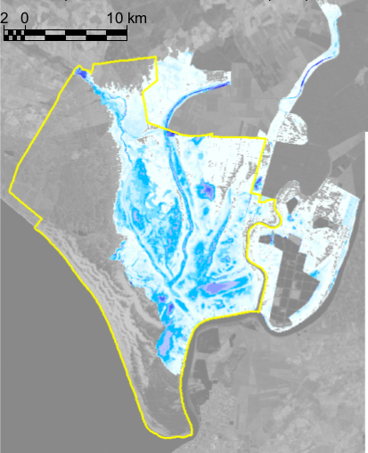 </a>
<br><a href="http://www.ebd.csic.es/ricardo/publi/Globwetland1.pdf">Díaz-Delgado et al. 2006</a>.</pw>
</div>

--- &twocol .class1 #id5 bg:url(assets/img/background_white_scientist_tablet.png);background-size:cover;
## Wetland applications - Inundation and hydroperiod

*** =left
<div>
<pw><a href="http://www.tdx.cat/handle/10803/145064"> </a>
<br><a href="http://www.tdx.cat/handle/10803/145064">Spaceborne SAR imagery for monitoring the inundation in the Doñana wetlands - Belén Martí Cardona</a>.<pw><a href="http://www.upc.edu/"> </a></pw>
</div>

*** =right

+ C-band SAR
+ Specialised terrain based filtering techniques
+ Now Sentinel 1 (A+B) available! 6-12 day revist time.
+ See [special issue on Remote Sensing in Wetlands](http://www.mdpi.com/journal/remotesensing/special_issues/wetland)

--- &twocol .class1 #id5 bg:url(assets/img/background_white_scientist_tablet.png);background-size:cover;
## Wetland applications - Inundation and Carbon fluxes

<div style="position: absolute; left: 210px; top:150px;">
<pw><a href="http://digital.csic.es/handle/10261/72209"> </a>
<br><a href="http://digital.csic.es/handle/10261/72209">Morris et al. 2013 http://digital.csic.es/handle/10261/72209.</a>
</pw>
</div>

--- .class1 #id5 bg:url(assets/img/background_white_scientist_tablet.png);background-size:cover;
## Wetland applications - Inundation and Carbon fluxes

<div style="position: absolute; left: 210px; top:150px;">
<pw><a href="http://digital.csic.es/handle/10261/72209">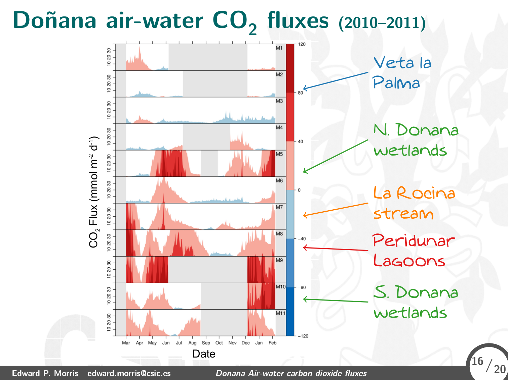 </a>
<br><a href="http://digital.csic.es/handle/10261/72209">Morris et al. 2013 http://digital.csic.es/handle/10261/72209.</a>
</pw>
</div>

--- .class1 #id5 
## Wetland applications - Land types

<!--
<iframe scrolling="yes" src="http://mapea-sigc.juntadeandalucia.es/?layers=WMS*Limites provinciales de Andalucia*http://www.ideandalucia.es/wms/mta400v_2008?*Division_Administrativa*false,WMS*Ortofoto Andalucia 2007*http://www.ideandalucia.es/wms/ortofoto2007?*oca10_2007*false,WMS_FULL*http://www.juntadeandalucia.es/medioambiente/mapwms/REDIAM_unidades_fisionomicas_paisaje_2009?*true,WMS*Nucleos de Poblacion*http://www.ideandalucia.es/wms/mta100v_2005?*Nucleos_de_Poblacion*true,WMS*Limites provinciales de Andalucia*http://www.ideandalucia.es/wms/mta400v_2008?*Division_Administrativa*true&amp;controls=mouse,panzoombar,layerswitcher,navtoolbar,measurebar&amp;getfeatureinfo=gml" frameborder="2" height="560" width="900"></iframe>
-->

<div style="position: absolute; left: 50px; top:120px;">
<pw><a href="http://www.juntadeandalucia.es/medioambiente/mapwms/REDIAM_unidades_fisionomicas_paisaje_2009?"> </a>
<br><a href=http://www.juntadeandalucia.es/medioambiente/mapwms/REDIAM_unidades_fisionomicas_paisaje_2009?>REDIAM - WMS Unidades fisionómicas de paisaje para el año 2009</a>
</pw>
</div>

--- .class1 #id5 bg:url(assets/img/background_white_scientist_tablet.png);background-size:cover;
## Wetland applications - Sentinels

<div style="position: absolute; left: 150px; top:110px;">
<pw><a href="http://www.fast-space-project.eu"> </a>
<br><a href="http://www.fast-space-project.eu">http://www.fast-space-project.eu</a>
</pw>
</div>

--- .class1 #id5 bg:url(assets/img/background_white_scientist_tablet.png);background-size:cover;
## Wetland applications - Intertidal elevation

<div style="position: absolute; left: 150px; top:110px;">
<pw><a href="http://www.fast-space-project.eu"> </a>
<br><a href="http://www.fast-space-project.eu">http://www.fast-space-project.eu</a>
</pw>
</div>

--- .class1 #id5 bg:url(assets/img/background_white_scientist_tablet.png);background-size:cover;
## Wetland applications - Impact of vegetation on coastal flood risk

<div style="position: absolute; left: 210px; top:150px;">
<pw><a href="http://www.fast-space-project.eu/index.php/services">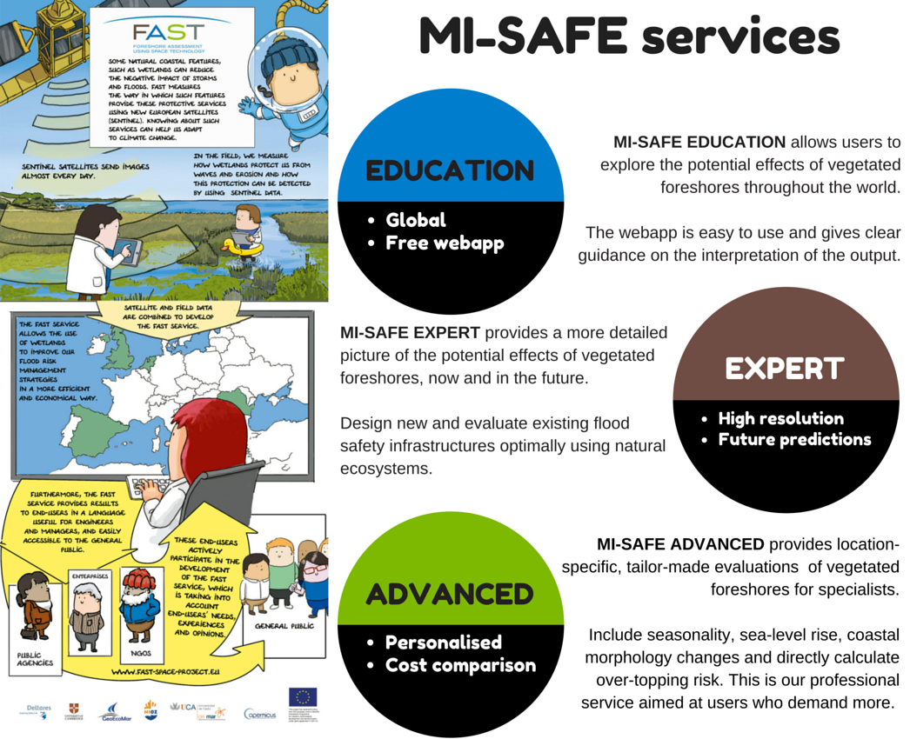 </a>
<br><a href="http://www.fast-space-project.eu/index.php/services">MI-SAFE services - FAST project</a>.</pw>
</div>

--- .class1 #id5 bg:url(assets/img/background_white_scientist_tablet.png);background-size:cover;
## Wetland applications - Impact of vegetation on coastal flood risk

<div style="position: absolute; left: 180px; top:150px;">
<pw><a href="https://publicwiki.deltares.nl/display/OET/The+Science+behind+the+MI-Safe+tool"> </a>
<br><a href="https://publicwiki.deltares.nl/display/OET/The+Science+behind+the+MI-Safe+tool">Science behind MI-SAFE tool - FAST project</a>.</pw>
</div>


--- .class1 #id5 bg:url(assets/img/background_white_scientist_tablet.png);background-size:cover;
## Wetland applications - Impact of vegetation on coastal flood risk

### Protype MI-SAFE web-app - http://fast.openearth.eu/

<div style="position: absolute; left: 180px; top:225px;">
<pw><a href="http://fast.openearth.eu/"> </a>
<br><a href="http://fast.openearth.eu/">MI-SAFE web-app - FAST project</a>.</pw>
</div>

--- .segue #id4 bg:url(assets/img/background_scientist_marsh.png);background-size:cover;
## How to access remote sensing data

--- .class1 #id5 bg:url(assets/img/background_white_scientist_tablet.png);background-size:cover;
## Data availability

```{r table_sensors, echo=FALSE, message=FALSE, warning=FALSE, results='asis'}
tb <- read.csv2("assets/data/OA-earth-observation-data.csv")
require(knitr)
kable(x=tb, format="html", digits = getOption("digits"), row.names = NA, col.names = c("Name",	"Abbreviation",	"Resolution (m)",	"Availability",	"Return Interval",	"Type*"	,"Platform"), 
    align= NULL, caption = "Some earth observation satellites with open access data, based on <a href=http://wiki.landscapetoolbox.org/doku.php/remote_sensor_types:home>wiki.landscapetoolbox.org</a>. *C=Color, E=Elevation, H=Hyperspectral, M=Multispectral, P=Panchromatic, R=Syntheric Aperature Radar"
    #, format.args = list()
    , escape = TRUE)

```


--- .class1 #id5 bg:url(assets/img/background_white_scientist_tablet.png);background-size:cover;
## Data type and format
### Landsat Missions Timeline

<div>
<pw><a href="http://landsat.usgs.gov//about_mission_history.php"> </a>
<br><a href="http://landsat.usgs.gov//about_mission_history.php">http://landsat.usgs.gov//about_mission_history.php</a>.</pw>
</div>

--- &twocol .class1 #id5 bg:url(assets/img/background_white_scientist_tablet.png);background-size:cover;
## Data type and format
### Landsat product types

*** =right

+ High latitudes (> 65º) may not be valid.

<div>
<pw><a href="http://landsat.usgs.gov//landsat_level_1_standard_data_products.php"> </a>
<br><a href="http://landsat.usgs.gov//landsat_level_1_standard_data_products.php">http://landsat.usgs.gov//landsat_level_1_standard_data_products.php</a>.</pw>
</div>

*** =left

Generally *surface reflectance* products are prefered, however see [L8-SR user notes](http://landsat.usgs.gov/documents/Provisional_Landsat_8_SURFACE_REFLECTANCE_EE.pdf) and [Landsat Higher Level Science Data Products](http://landsat.usgs.gov/CDR_ECV.php):

+ not completely validated
+ not all scenes can be processed: Landsat 8 Pre-WRS-2 scenes (before April 11, 2013), scenes with a solar zenith angle greater than 76°.
+ Efficancy of L8SR correction will be likely reduced in: Hyper arid or snow covered regions, Low sun angle conditions, <b>Coastal regions where land area is small relative to adjacent water</b>, Areas with extensive cloud contamination.

--- .class1 #id5 bg:url(assets/img/background_white_scientist_tablet.png);background-size:cover;
## Data format and type
### Landsat Standard L1 products

+ Standard Terrain Correction (Level 1T -precision and terrain correction) if possible.
+ Cubic Convolution (CC) resampling method.
+ 30-meter (TM, ETM+, OLI) and 60-meter (MSS) pixel size (reflective bands).
+ Universal Transverse Mercator (UTM) map projection (Polar Stereographic projection for scenes with a center latitude greater than or equal to -63.0 degrees).
+ World Geodetic System (WGS) 84 datum.
+ MAP (North-up) image orientation.
+ GeoTIFF per band, quality assement + metadata (`.MTL`)

<div style="position: absolute; left: 700px; top:380px;">
 
</div>

--- .class1 #id5 bg:url(assets/img/background_white_scientist_tablet.png);background-size:cover;
## Data format and type
### Landsat Higher Level Science Data products

+ [surface reflectance](http://landsat.usgs.gov/CDR_LSR.php)
    + includes basic classification (water, cloud) and per pixel quality mask
    + metadata is .xml (schema: [http://espa.cr.usgs.gov/v1.2](http://espa.cr.usgs.gov/schema/espa_internal_metadata_v1_2.xsd))
+ [surface reflectance spectral indices](http://landsat.usgs.gov/documents/si_product_guide.pdf)
+ transport format as standard GeoTIFF or ENVI binary or HDF-EOS2, see [guide](http://landsat.usgs.gov/documents/espa_odi_userguide.pdf) 

<div style="position: absolute; left: 400px; top:400px;">
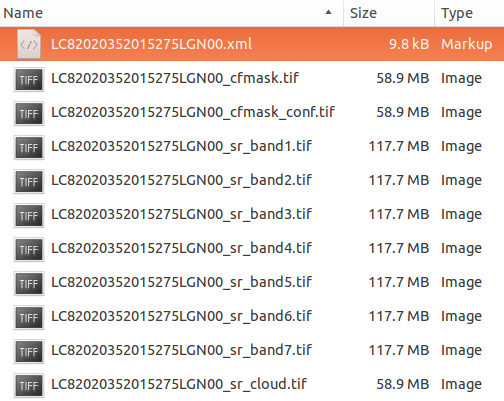 
</div>


--- .class1 #id5 bg:url(assets/img/background_white_scientist_tablet.png);background-size:cover;
## Data type and format
### Sentinels Timeline

<div style="position: absolute; left: 10px; top:170px;">
<pw><a href="http://www.unoosa.org/pdf/pres/stsc2015/tech-53E.pdf"> </a>
<br><a href="http://www.unoosa.org/pdf/pres/stsc2015/tech-53E.pdf">ESA, http://www.unoosa.org/pdf/pres/stsc2015/tech-53E.pdf</a>.</pw>
</div>

<div style="position: absolute; left: 500px; top:170px;">
<pw><a href="http://www.unoosa.org/pdf/pres/stsc2015/tech-53E.pdf">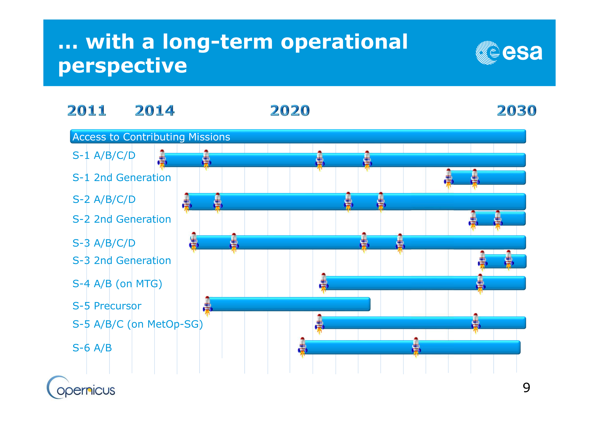 </a>
<br><a href="http://www.unoosa.org/pdf/pres/stsc2015/tech-53E.pdf">ESA, http://www.unoosa.org/pdf/pres/stsc2015/tech-53E.pdf</a>.</pw>
</div>

--- .class1 #id5 bg:url(assets/img/background_white_scientist_tablet.png);background-size:cover;
## Data type and format
### Sentinel 1 product types

<div>
<pw><a href="https://sentinel.esa.int/web/sentinel/missions/sentinel-1/data-products">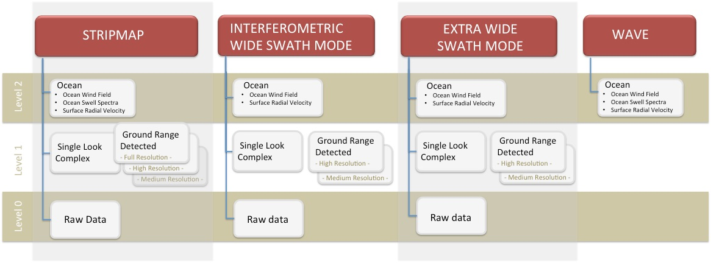 </a>
<br><a href="https://sentinel.esa.int/web/sentinel/missions/sentinel-1/data-products">https://sentinel.esa.int/web/sentinel/missions/sentinel-1/data-products</a>.</pw>
</div>

--- &twocol .class1 #id5 bg:url(assets/img/background_white_scientist_tablet.png);background-size:cover;
## Data type and format
### Sentinel 1 product format

*** =right
The SENTINEL-SAFE format wraps a folder containing image data in a binary data format and product metadata in XML.

*** =left
<div>
<pw><a href="https://earth.esa.int/web/sentinel/user-guides/sentinel-1-sar/data-formats/sar-formats"> </a>
<br><a href="https://earth.esa.int/web/sentinel/user-guides/sentinel-1-sar/data-formats/sar-formats">https://earth.esa.int/web/sentinel/user-guides/sentinel-1-sar/data-formats/sar-formats</a>.</pw>
</div>

--- .class1 #id5 bg:url(assets/img/background_white_scientist_tablet.png);background-size:cover;
## Data type and format
### Sentinel 2 product types

<div>
<pw><a href="https://sentinel.esa.int/web/sentinel/missions/sentinel-2/data-products"> </a>
<br><a href="https://sentinel.esa.int/web/sentinel/missions/sentinel-2/data-products">https://sentinel.esa.int/web/sentinel/missions/sentinel-2/data-products</a>.</pw>
</div>

--- &twocol .class1 #id5 bg:url(assets/img/background_white_scientist_tablet.png);background-size:cover;
## Data type and format
### Sentinel 2 product format

*** =right
The SENTINEL-SAFE format wraps a folder containing image data in a binary data format and product metadata in XML.

*** =left
<div>
<pw><a href="https://sentinel.esa.int/web/sentinel/user-guides/sentinel-2-msi/data-formats"> </a>
<br><a href="https://sentinel.esa.int/web/sentinel/user-guides/sentinel-2-msi/data-formats">https://sentinel.esa.int/web/sentinel/user-guides/sentinel-2-msi/data-formats</a>.</pw>
</div>


--- &twocol .class1 #id5 bg:url(assets/img/background_white_scientist_tablet.png);background-size:cover;
## Earth Explorer 

*** =right

+ surface reflectance products generated 'on demand'.

<div>
<pw><a href="http://earthexplorer.usgs.gov/"> </a>
<br><a href="http://earthexplorer.usgs.gov/">http://earthexplorer.usgs.gov/</a>.</pw>
</div>

*** =left

+ official bulk dissemination system for the Landsat (and other) products.
+ requires registration (quick and easy); email address used to send download links! 
+ no restrictions on data use but requested to acknowledge source:
    + USGS Products: 	'Data available from the U.S. Geological Survey.'
    + NASA LP DAAC Products: 	'These data are distributed by the Land Processes Distributed Active Archive Center (LP DAAC), located at USGS/EROS, Sioux Falls, SD. http://lpdaac.usgs.gov'


--- &twocol .class1 #id5 bg:url(assets/img/background_white_scientist_tablet.png);background-size:cover;
## Sentinel Scientific Data Hub 

*** =right
<div>
<pw><a href="https://scihub.esa.int"> </a>
<br><a href="https://scihub.esa.int">https://scihub.esa.int</a>.</pw>
</div>

*** =left

+ official bulk dissemination system for the Sentinels products
+ requires registration (quick and easy)
+ use of data implies acceptance of [Terms and Conditions of the use and distribution of Sentinel data](https://sentinel.esa.int/documents/247904/690755/Sentinel_Data_Terms_and_Conditions)
+ no limitations but must attribute 'Copernicus Sentinel data [Year]' or 'Contains modified Copernicus Sentinel data [Year]'


--- .class1 .smaller #id5 bg:url(assets/img/background_white_scientist_tablet.png);background-size:cover;
## Other examples of how to get the data

General:

+ [Google Earth Engine](https://earthengine.google.org) (GEE); Landsat archive, Sentinel-1 (available late 2015?), MODIS, MERRIS, ect. Sentinel-2 (planned).
    + Google Storage also mirrors much of these archives. You can install their “[gsutil](https://cloud.google.com/storage/docs/gsutil_install)” (free) and then list this directory, which is indexed by sensor (for example, L8 is Landsat 8) and path/row: `gsutil ls gs://earthengine-public/landsat/`
    + Note Sentinel-1 has undergone further pre-processing in GEE 

Sentinels:

+ [Sentinel Data Access Service (SEDAS)](http://sedas.satapps.org); useful portal by UK Space Agency

--- .class1 .smaller #id5 bg:url(assets/img/background_white_scientist_tablet.png);background-size:cover;
## Other examples of how to get the data

Landsat:

+ [USGS Earth Resources Observation and Science (EROS) Center Science Processing Architecture (ESPA) On Demand Interface](http://espa.cr.usgs.gov/) for higher level products and processing options
+ [Landsat Look](http://landsatlook.usgs.gov/) for quick looks and standard data
+ [GloVis](http://glovis.usgs.gov) an alternative to EarthExplorer
+ [Python Landsat-Download](http://olivierhagolle.github.io/LANDSAT-Download/)
+ [Python Landsat-util](https://github.com/developmentseed/landsat-util)

Via commandline using curl:

```
# download a specific sentinel product
S:\>curl -u User:Password -JO "https://scihub.esa.int/dhus/odata/v1/\
Products('b94d872a-ef4f-4117-8a6b-1a90466ae785')/$value"
```

--- .segue #id6 bg:url(assets/img/background_scientist_screen.png);background-size:cover;background-color:#604c3f;
## How to extract information

--- .class1 #id5 bg:url(assets/img/background_white_scientist_screen.png);background-size:cover;
## Basic concepts

Georectification: Mapping the data to real world coordinates.

Calibration: Converting the data to real world units
  
  + at-instrument; instrument-specific digital numbers to units , i.e., radiance 
  + top-of-atmosphere; accounting for platform to target geometry.
  + surface; removing atmospheric affects and corrections for topography

Morphological operations: Filtering, changing resolution, ect.

Course classification: Assigning different classes (e.g., clouds, shadows, water) using segmentation or clustering.

--- &twocol  .class1 #id5 bg:url(assets/img/background_white_scientist_screen.png);background-size:cover;
## Open source image processing (some options)

*** =left
with GUI:

+ [Sentinel Application Platform (SNAP)](http://step.esa.int/main/download/); official software for processing sentinel data, integrates NEST and BEAM.
+ [Quantum GIS (QGIS)](www.qgis.org); extensible GIS system with many plugins linking to image processing packages (BEAM plugin).
+ [BEAM](http://www.brockmann-consult.de/cms/web/beam/releases)
+ [SeaDas](http://seadas.gsfc.nasa.gov/)
+ [Monteverdi2](http://sourceforge.net/projects/orfeo-toolbox/files/?source=navbar)
+ [GRASS](https://grass.osgeo.org/)

*** =right

Packages and frameworks:

+ [Google Earth Engine](https://earthengine.google.org); JavaScript and Python
+ [Orpheo Toolbox (OTB)](https://www.orfeo-toolbox.org); C
+ [RSGISLib](http://www.rsgislib.org/); Python 
+ [OpenCV](http://opencv.org/); C, Python
+ [raster](https://cran.r-project.org/web/packages/raster/index.html); R

--- .class1 #id5 bg:url(assets/img/background_white_scientist_screen.png);background-size:cover;
## Sentinel Application Platform (SNAP)
### A common architecture for all Sentinel Toolboxes

+ open-source (Java) available at [GitHub](https://github.com/senbox-org) or precompiled at [STEP](http://step.esa.int/main/download/).
+ successor of the mature BEAM + NEST software.
+ efficient parralization of calculations resulting in good performance on modern PCs.
+ Python bindings available soon?
+ Sensor specific toolboxes (Sentinels, but also many other sensors).
+ Developed by Array Systems and DLR (S-1), C-S (S-2) and Brockmann Consult (S-3) for ESA.

--- .class1 #id5 bg:url(assets/img/background_white_scientist_screen.png);background-size:cover;

## Sentinel Application Platform (SNAP)

<div>
<pw><a href="http://step.esa.int/main/toolboxes/snap/"> </a>
<br><a href="http://step.esa.int/main/toolboxes/snap/">http://step.esa.int/main/toolboxes/snap/</a>.</pw>
</div>

--- .class1 #id5 bg:url(assets/img/background_white_scientist_screen.png);background-size:cover
## Getting help 

+ Detailed in built help
+ [Toolbox tutorials](http://step.esa.int/main/doc/tutorials/), also consider NEST and BEAM tutorials.
+ [SNAP forum](http://forum.step.esa.int/); a shared user experience
+ [SNAP development](http://step.esa.int/main/developers/); how to contribute

--- .class1 #id5 bg:url(assets/img/background_white_scientist_screen.png);background-size:cover;
## The power of the Graph Builder and Graph Processing Tool (GPT)

+ graphical building of workflows [graphs]
+ save workflows in XML and share
+ apply to single image or batch process many images
+ run from within the GUI or the command line (GPT)

--- .class1 #id5 bg:url(assets/img/background_white_scientist_screen.png);background-size:cover;
## ESA Research and Service Support (RSS)

'[RSS](www.rssportal.esa.int) has the mission to support the Earth Observation (EO) comunity in exploiting EO data'

+ supports institutions, scientists and developers.
+ supports data provisioning, access and processing.
+ help to scale up workflows
+ <b>computation on demand</b> and <b>cloud computing service</b> free for 'non-profit' organisations.
    + contact rss_team@esa.int to check conditions and egibility.


--- .thankyou #id5 bg:url(assets/img/background_white_scientist_screen.png);background-size:cover;
## Acknowledgents

<p>
 The research leading to these results has received funding from the European Union Seventh Framework Programme (FP7/2007-2013) under grant agreement n° 607131. All views presented are those of the author’s, the European Union is not liable for any use that may be made of the information contained therein.
</p>
+ The [FAST project](http://www.fast-space-project.eu) team for support and contributions.
+ Landsat data courtesy of [USGS](http://www.usgs.gov/).
+ This presentation includes [Copernicus](http://www.copernicus.eu/) Sentinel data 2015.
+ Videos from [ESA](http://www.esa.int) [YouTube](http://www.youtube.com) channels.
+ ['Stuff in Space'](http://stuffin.space) by James Yoder. 
+ Comic design and production; [The Pilot Dog](http://www.thepilotdog.com)
+ Slide deck made using [slidify](http://slidify.org/)

--- &twocol .thankyou #id5 bg:url(assets/img/background_white_scientist_screen.png);background-size:cover;
## Find out more about FAST

*** =left

+ www.fast-space-project.eu
+ [@FP7FAST](https://twitter.com/fp7fast)
+ Facebook [FastSpaceProject](http://www.facebook.com/FastSpaceProject)

Get this talk:

+ slides: http://edwardpmorris.github.io/uimp_teaching
+ source: https://github.com/edwardpmorris/uimp_teaching

*** =right

<div>
<pw><a data-flickr-embed="true"  href="https://www.flickr.com/photos/125003624@N04/16775340361/in/album-72157645545234996/" title="Foreshore Assessment using Space Technology project comic strip (EN)"></a></pw>
</div>
